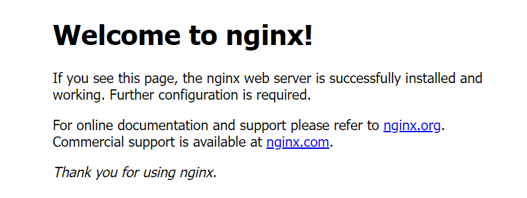
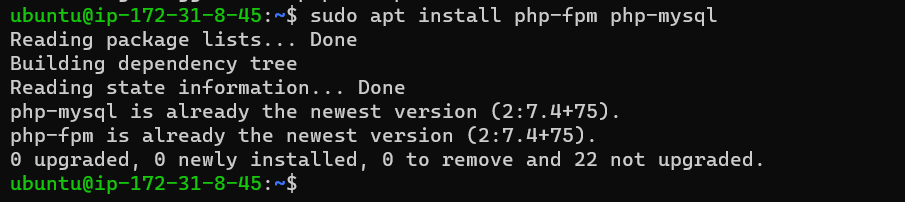

### PROJECT 2: LEMP STACK IMPLEMENTATION

LEMP is an open-source web application stack used to develop web applications. The term LEMP is an acronym that represents L for the Linux Operating system, Nginx (pronounced as engine-x, hence the E in the acronym) web server, M for MySQL database, and P for PHP scripting language.

**Step 1 – Installing the Nginx Web Server**

Nginx is a web server that follows an event-driven approach and handles multiple requests within one thread. Nginx supports all Unix-like OS and also supports windows partially.

  - To install the Nginx web server update the ubuntu repositories:

  `sudo apt update`

  - Install Nginx web server using: 

  `sudo apt install nginx`

    

  - Verify that Nginx has successfully installed and running:

      `sudo systemctl status nginx`

        

    - Open TCP port 80 which is default port that web brousers use to access web pages in the Internet.

    `curl http://localhost:80`

  - Test to validate that Nginx server can respond to requests from the Internet on any web browser.

        `http://<Public-IP-Address>:80`

        

**Step 2 – Installing MYSQL**
MySQL is an open-source SQL-based database that is used to store data and manipulate data while maintaining data consistency and integrity. It organizes data in tabular form in rows and columns.

- Install MySQL using:

  `sudo apt install mysql-server`

- Log in to the MySQL console by typing:

 `sudo apt install mysql-server`

- After installation is completed, log in to the MySQL console by typing:

  `sudo mysql`

- Then exit MySQL

- Run a security script that comes pre-installed with MySQL

  `sudo mysql_secure_installation`

- Test connection by logging into MySQL using :

  `sudo mysql -p`

- Then exit MySQL

 `mysql> exit`

  
    

**Step 3 – Installing PHP**

PHP is the component of our setup that will process code to display dynamic content to the end user.
Nginx requires an external program to handle PHP processing and act as a bridge between the PHP interpreter itself and the web server. 
This allows for a better overall performance in most PHP-based websites, but it requires additional configuration. 

Installation of php-fpm is required, which stands for **“PHP fastCGI process manager”** ,  in addition to this php-mysql, a PHP module that allows PHP to communicate with MySQL-based databases is needed. Core PHP packages will automatically be installed as dependencies.

- To install these 2 packages at once, run:

 `sudo apt install php-fpm php-mysql`

**Step 4— Configuring Nginx To Use PHP Processor**

On Ubuntu 20.04, Nginx has one server block enabled by default and is configured to serve documents out of a directory at /var/www/html. While this works well for a single site, it can become difficult to manage if you are hosting multiple sites. Instead of modifying /var/www/html, we’ll create a directory structure within /var/www for the your_domain website, leaving /var/www/html in place as the default directory to be served if a client request does not match any other sites.

- Create the root web directory for your_domain as follows:

 `sudo mkdir /var/www/projectLEMP`

- Assign ownership of the directory with the $USER environment variable, which will reference the current system user:

  `sudo chown -R $USER:$USER /var/www/projectLEMP`

- Open a new configuration file in Nginx’s sites-available directory 

  `sudo nano /etc/nginx/sites-available/projectLEMP`

- Paste in the following bare-bones configuration:

`server {
    listen 80;
    server_name projectLEMP www.projectLEMP;
    root /var/www/projectLEMP;

    index index.html index.htm index.php;

    location / {
        try_files $uri $uri/ =404;
    }

    location ~ \.php$ {
        include snippets/fastcgi-php.conf;
        fastcgi_pass unix:/var/run/php/php7.4-fpm.sock;
     }

    location ~ /\.ht {
        deny all;
    }

}`
- Activate the configuration by linking to the configuration file from Nginx’s sites-enabled directory:

 `sudo ln -s /etc/nginx/sites-available/projectLEMP /etc/nginx/sites-enabled/`

- Test the configuration for syntax errors:

 `sudo nginx -t`

  

- Disable the Default Nginx host

  `sudo unlink /etc/nginx/sites-enabled/default`

- Reload Nginx to apply the changes

  `sudo systemctl reload nginx`

- Create an index.html file in web root /var/www/projectLEMP in order to test that the new server block works as expected:
 `sudo echo 'Hello LEMP from hostname' $(curl -s http://169.254.169.254/latest/meta-data/public-hostname) 'with public IP' $(curl -s http://169.254.169.254/latest/meta-data/public-ipv4) > /var/www/projectLEMP/index.html`

 

**Step 5 – Testing PHP with Nginx**
 
At this point, the LAMP stack is completely installed and fully operational. To validate that Nginx can correctly hand .php files off to your PHP processor. Create a test PHP file in your document root by opening a new file called info.php within your document root.

`<?php
phpinfo();`

- Access this page in the web browser by visiting the public IP address, followed by info.php

- Remove the file created as it contains sensitive information about the PHP environment and the Ubuntu server with command below:

 `sudo rm /var/www/your_domain/info.php`

**Step 6 — Retrieving data from MySQL database with PHP**

- Connect to MySql using the root account:

 `sudo mysql`
    OR

  ` sudo mysql -u username -pPassword`

- Create a new database called example_database

 `CREATE DATABASE `example_database`;`

- Create a new user and grant the user full privileges on the database you created

 `CREATE USER 'example_user'@'%' IDENTIFIED WITH mysql_native_password BY 'password';`

 `GRANT ALL ON example_database.* TO 'example_user'@'%';`

- Test if the new user has the proper permissions to log into the MySQL console again, this time use the custom user credentials:

 `mysql -u example_user -p`

- Confirm you have access to the example_database database:
 `SHOW DATABASES;`

 

- Create a test table named todo_list. From the MySQL console, run the following statement:

 `CREATE TABLE example_database.todo_list (
item_id INT AUTO_INCREMENT,
content VARCHAR(255),
PRIMARY KEY(item_id)
);`

- Insert a few rows of content in the test table. You might want to repeat the next command a few times, using different VALUES:

 `mysql> INSERT INTO example_database.todo_list (content) VALUES ("My first important item");`

- To confirm that the data was successfully saved to your table, run:

 `SELECT * FROM example_database.todo_list;`

- Then exit MySQL

- Now you can create a PHP script that will connect to MySQL and query for your content. Create a new PHP file in your custom web root directory using your preferred editor. We’ll use vi for that:

 `nano /var/www/projectLEMP/todo_list.php`

- Enter the script below into todo_list.php:

 `<?php
$user = "example_user";
$password = "password";
$database = "example_database";
$table = "todo_list";

try {
  $db = new PDO("mysql:host=localhost;dbname=$database", $user, $password);
  echo "<h2>TODO</h2><ol>";
  foreach($db->query("SELECT content FROM $table") as $row) {
    echo "<li>" . $row['content'] . "</li>";
  }
  echo "</ol>";
} catch (PDOException $e) {
    print "Error!: " . $e->getMessage() . " ";
    die();
}`

- You can now access this page in your web browser by visiting the domain name or public IP address configured for your website, followed by /todo_list.php:

