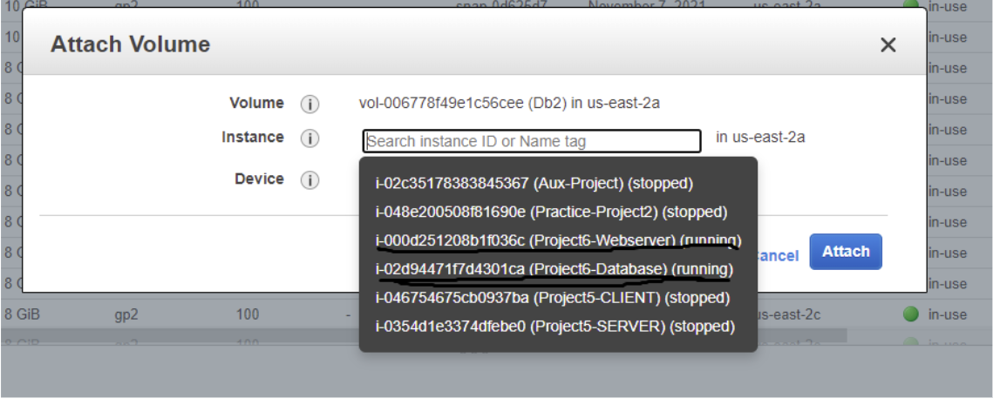

###  Web Solution With WordPress

The aim of this project is to prepare storage infrastructure on two Linux servers and implement a basic web solution using WordPress

### Three-tier Architecture
Generally, web, or mobile solutions are implemented based on what is called the Three-tier Architecture.

Three-tier Architecture is a client-server software architecture pattern that comprise of 3 separate layers

### The 3-Tier Setup
A Laptop or PC to serve as a client
An EC2 Linux Server as a web server (This is where you will install WordPress)
An EC2 Linux server as a database (DB) server

This project consists of two parts:

1. Configure storage subsystem for Web and Database servers based on Linux OS.
2. Install WordPress (webserver) and connect it to a remote MySQL database server (database server).

In this project , we will ensure that the disks used to store files on the Linux servers are adequately partitioned and managed through programs such as gdisk and LVM respectively.

### LAUNCH TWO EC2 INSTANCE THAT WILL SERVE AS “WEB SERVER & DATABASE SERVER”

In this project we wil be using 'Redhat' (fully compatible derivative - CENTOS).

Create and configure two linux-based virtual servers (EC2 instances in AWS): Webserver and Database.

Create 3 Volumes for the Webserver and Database instances respectively in the same availabilty zone same as what is showing in the instances created.

### PREPARING THE WEB SERVER

- Launch an EC2 instance that will serve as "Web Server" then, Create 3 volumes and attach to the instance in the same availability zone a the Web Server EC2, each of 10 GiB.

 

- Open the linux terminal to begin configuration, use command below to inspect what block devices are attached to the server. Make sure you see all 3 newly created block devices there – their names will likely be xvdf, xvdh, xvdg

 `lsblk` 

- To see all mounts and free space on the server use thecommand below.

 `df -h`

- Use gdisk utility to create a single partition on each of the 3 disks

 `sudo gdisk /dev/xvdf /dev/xvdg /dev/xvdh`

- View the newly configured partition on each of the 3 disks.

 `lsblk`

 

- Install lvm2 package 
  `sudo yum install lvm2`
  
- Run `sudo lvmdiskscan` command to check for available partitions.

- Use *pvcreate* utility to mark each of 3 disks as physical volumes (PVs) to be used by LVM

`sudo pvcreate /dev/xvdf1`
`sudo pvcreate /dev/xvdg1`
`sudo pvcreate /dev/xvdh1`

- Verify that your Physical volume has been created successfully by running:
	`sudo pvs` 

- Use *vgcreate*  utility to add all 3 PVs to a volume group (VG). Name the VG webdata-vg

`sudo vgcreate webdata-vg /dev/xvdh1 /dev/xvdg1 /dev/xvdf1`

- Verify that the VG has been created successfully by running

`sudo vgs`

- Use *lvcreate*  utility to create 2 logical volumes. apps-lv, and logs-lv. apps-lv. This will be used to store data for the Website while, logs-lv will be used to store data for logs.

	`sudo lvcreate -n apps-lv -L 14G webdata-vg`
    `sudo lvcreate -n logs-lv -L 14G webdata-vg`

- Verify that the Logical Volume has been created successfully by running

 `sudo lvs`

 

- Verify the entire setup
 `sudo vgdisplay -v #view complete setup - VG, PV, and LV`
 `sudo lsblk`

- Format the logical volumes with ext4 filesystem

 `sudo mkfs -t ext4 /dev/webdata-vg/apps-lv`
 `sudo mkfs -t ext4 /dev/webdata-vg/logs-lv`

  

- Create **/var/www/html** directory to store website files and **/home/recovery/logs** to store backup of log data

  `sudo mkdir -p /var/www/html`
  `sudo mkdir -p /home/recovery/logs`

-Mount **/var/www/html** on apps-lv logical volume

`sudo mount /dev/webdata-vg/apps-lv /var/www/html/`

- Restore log files back into /var/log directory

 `sudo rsync -av /home/recovery/logs/. /var/log`
 
 

 **Update /etc/fstab file** 

- Update the /etc/fstab file with the UUID, this ensures the mount configuration will persist after restart of the server.

- Use the below command to retrieve this and then update the fstab file rememebering to remove the leading and ending quotes.

 `sudo blkid`
 `sudo vi /etc/fstab`

- Test the configuration and reload the daemon

 `sudo mount -a`
 `sudo systemctl daemon-reload`

- Verify your setup by running the command below:  

 `df -h`

 

**Install WordPress on your Web Server EC2** 

- After Step 1 in Preparing Database Server has been completed

- Install Wordpress on the webserver instance following the steps below:

- Update the repository

 `sudo yum -y update`

- Install wget, Apache and it’s dependencies

 `sudo yum -y install wget httpd php php-mysqlnd`
 `php-fpm php-json`

- Start Apache

 `sudo systemctl enable httpd`
 `sudo systemctl start httpd`

- Install PHP and it’s depemdencies

 `sudo yum install https://dl.fedoraproject.org/pub/epel/epel-release-latest-8.noarch.rpm`
 `sudo yum install yum-utils http://rpms.remirepo.net/enterprise/remi-release-8.rpm`
 `sudo yum module list php`
 `sudo yum module reset php`
 `sudo yum module enable php:remi-7.4`
 `sudo yum install php php-opcache php-gd php-curl php-mysqlnd`
 `sudo systemctl start php-fpm`
 `sudo systemctl enable php-fpm`
 `setsebool -P httpd_execmem 1`

- Restart Apache

`sudo systemctl restart httpd`

- Download wordpress and copy wordpress to var/www/html

 `mkdir wordpress`
  `cd   wordpress`
  `sudo wget http://wordpress.org/latest.tar.gz`
  `sudo tar xzvf latest.tar.gz`
  `sudo rm -rf latest.tar.gzv`
  `cp wordpress/wp-config-sample.php wordpress/wp-config.php`
  `cp -R wordpress /var/www/html/`

- Configure SELinux Policies

  `sudo chown -R apache:apache /var/www/html/wordpress`
  `sudo chcon -t httpd_sys_rw_content_t /var/www/html/wordpress -R`
  `sudo setsebool -P httpd_can_network_connect=1`

### PREPARING THE DATABASE SERVER

**Step 1** 

- Launch a second RedHat EC2 instance that will have a role – ‘DB Server’

- Repeat the same steps as for the Web Server, but instead of apps-lv create db-lv and mount it to /db directory instead of /var/www/html/.

**Step 2  :  Install MySQL on your DB Server EC2**

- After installing WordPress on the Web Server EC2. Install MysQL on the Database server using:

 `sudo yum update`
 `sudo yum install mysql-server`

- Verify that the service is up and running by using

 `sudo systemctl status mysqld`

- If it is not running, restart the service and enable it so it will be running even after reboot:

 `sudo systemctl restart mysqld`
 `sudo systemctl enable mysqld`

**Step 3  :  Configure DB to work with WordPress**

 `sudo mysql`
 `CREATE DATABASE wordpress;`
 `CREATE USER `myuser`@`<Web-Server-Private-IP-Address>` IDENTIFIED BY 'mypass';`
 `GRANT ALL ON wordpress.* TO 'myuser'@'<Web-Server-Private-IP-Address>';`
 `FLUSH PRIVILEGES;`
 `SHOW DATABASES;`
 `exit`

**Configure WordPress to connect to remote database.**

To allow wordpress to connect to the database open MySQL port 3306 on DB Server EC2. For extra security, only allowed access to the DB server only from the Web Server’s IP address, so in the Inbound Rule configuration specify source as /32

- Install MySQL client and test that you can connect from your Web Server to your DB server by using mysql-client

 `sudo yum install mysql`
 `sudo mysql -u admin -p -h <DB-Server-Private-IP-address>`

- Verify if you can successfully execute **SHOW DATABASES**; command and see a list of existing databases.

- In the Database Server EC2 instance, edit my.cnf.d file in /etc folder to include bind-address 0.0.0.0
 
 `sudo vi /etc/my.cnf.d`

- restart mysql

 `Sudo systemctl restart mysqld`

- Disable the default page of Apache 

 `mv /etc/httpd/conf.d/welcome.conf /etc/httpd/conf.d/welcome.conf_backup`

- Open MYSQL port 3306 on the Database Server EC2, for extra security allow access to the Database server ONLY from the WebServer's IP address.

- To confirm if Webserver EC2 can communicate with Database EC2, run
 `sudo mysql -h <ip address> -u wordpress -p`

- Enabled TCP port 80 in Inbound Rules configuration for the Web Server EC2(enable from everywhere 0.0.0.0/0 or from your workstation’s IP)

- Try to access from your browser the link to your WordPress 
 `http://<Web-Server-Public-IP-Address>/wordpress/`

