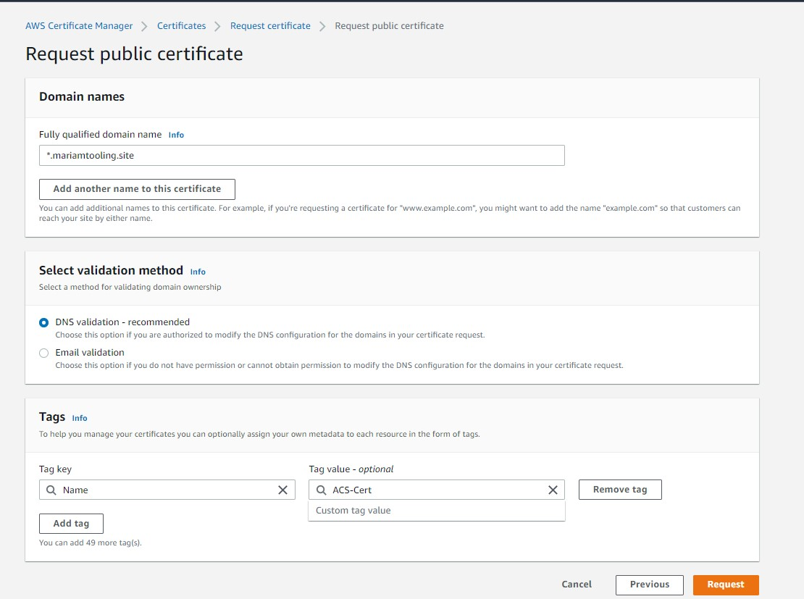

# AWS CLOUD SOLUTION FOR 2 COMPANY WEBSITES USING A REVERSE PROXY TECHNOLOGY

# Set Up A Virtual Private Network (VPC).

- Create a VPC & enable the DNS hostnames.

- Create Internet gateway and attach it to the VPC.

- Create subnets as shown in the diagram below. For the public subnet, we create 2 subnets in different availability zone **A** and **B** respectively and for the private subnet we create 4 subnets.

- Create two Route table and associate each route table with the **public** and **private** subnets

- Associate the route table to the subnet by associating the public route table to the public subnet and the provate route table to the private subnet following the step below :

  - Select the public route table you created, click Actions on the top and click 'Edit Subnet associations'
  - Select the public subnets and click save , repeat the process for the private route table

- Edit route for each route table. For the Public route table -> Edit route, the setting is to enable the subnet attached to the route table have access to the internet so the target will be the Internet Gateway i.e communicating with the internet via the internet gateway

- Create an Elastic IP address that will be used by the NAT-Gateway.

- Create the Nat-Gateway, created in a public subnet and attached the Elastic IP created.

- Go back to the route table and edit Private route table in the edit routes, set target to the Nat-Gateway created earlier.

Create security group for:

- External Load balancer - Traffic from the internet (http, https).

- Bastion - SSH access from your computer.

- Nginx (Reverse Proxy Server) - Source of traffic only from the external load balancer and SSH from Bastion.

Internal Load balancer - traffic only form Nginx.

Webserver - traffic source from Internal Load Balancer and SSH from Bastion only.

Datalayer - traffic from Bastion (Mysql), Webserver (NFS and Mysql).

- Create certificate, ensure domain purchased is transferred to AWS Route 53. The major reason for creating a certificate first is mainly because when creating an application load balancer there is need to select a certificate because all our instances behind a load balancer listens to traffic from port 443. Ensure to create record on Route 53 after creating the certificate. This are certificates we attach to all the load balancers.

Since you selected DNS validation, it will automatically write to the route 53 record.

- Create Amazon Elastic Files System(EFS): Add mount target to the filesystem i.e specifying subnet. Wherever you specify your mount target the Amazon EFS becomes available in that subnet as such we specify it in private subnet 1 & 2 so that all the resources in that subnet will have the ability to mount to the file system and set security group setting to datalayer security we created.

- Create access point  which will specify where the webservers will mount with, thus creating 2 mount points for Tooling and Wordpress webservers each the purpose of creatiing two accesspoint is to avoid the files from the servers overwriting each other in a single access point instance.

- Then create Amazon RDS, before we commence on that we need to create KMS key (to encrypt RDS instance) and subnet group (placed in private

# Amazon RDS
 Select Subnet group > Create DB subnet group

- Then go to dashboard select create database

The next step is to:

- Create Autoscaling group : The two requirements are **Launch Templates** and **Load Balancers**. The Launch Templates requires an **AMI** and **Userdata** while the Load balancer requires **target group**

The following steps below must take place before creating the Autoscaling group.

Create 3 Instances (Redhat) with security group (All traffic - anywhere) named Bastion, Nginx and Webserver.

Launch each instance and do some installation on them.

For Bastion, Nginx and Webserver.

 word press data

 #!/bin/bash
mkdir /var/www/
sudo mount -t efs -o tls,accesspoint=fsap-0d1558e9722bfd18a fs-06d977b1fb7793ae3:/ /var/www/
yum install -y httpd 
systemctl start httpd
systemctl enable httpd
yum module reset php -y
yum module enable php:remi-7.4 -y
yum install -y php php-common php-mbstring php-opcache php-intl php-xml php-gd php-curl php-mysqlnd php-fpm php-json
systemctl start php-fpm
systemctl enable php-fpm
wget http://wordpress.org/latest.tar.gz
tar xzvf latest.tar.gz
rm -rf latest.tar.gz
cp wordpress/wp-config-sample.php wordpress/wp-config.php
mkdir /var/www/html/
cp -R /wordpress/* /var/www/html/
cd /var/www/html/
touch healthstatus
sed -i "s/localhost/acs-database.csgtfa2el0hg.ca-central-1.rds.amazonaws.com/g" wp-config.php 
sed -i "s/username_here/ACSadmin/g" wp-config.php 
sed -i "s/password_here/admin12345/g" wp-config.php 
sed -i "s/database_name_here/wordpressdb/g" wp-config.php 
chcon -t httpd_sys_rw_content_t /var/www/html/ -R
systemctl restart httpd

# Tooling
#!/bin/bash
mkdir /var/www/
sudo mount -t efs -o tls,accesspoint=fsap-0b2308634ce2a0430 fs-06d977b1fb7793ae3:/ /var/www/
yum install -y httpd 
systemctl start httpd
systemctl enable httpd
yum module reset php -y
yum module enable php:remi-7.4 -y
yum install -y php php-common php-mbstring php-opcache php-intl php-xml php-gd php-curl php-mysqlnd php-fpm php-json
systemctl start php-fpm
systemctl enable php-fpm
git clone https://github.com/Livingstone95/tooling-1.git
mkdir /var/www/html
cp -R /tooling-1/html/*  /var/www/html/
cd /tooling-1
mysql -h acs-database.cdqpbjkethv0.us-east-1.rds.amazonaws.com -u ACSadmin -p toolingdb < tooling-db.sql
cd /var/www/html/
touch healthstatus
sed -i "s/$db = mysqli_connect('mysql.tooling.svc.cluster.local', 'admin', 'admin', 'tooling');/$db = mysqli_connect('acs-database.csgtfa2el0hg.ca-central-1.rds.amazonaws.com', 'ACSadmin', 'admin12345', 'toolingdb');/g" functions.php
chcon -t httpd_sys_rw_content_t /var/www/html/ -R
systemctl restart httpd
